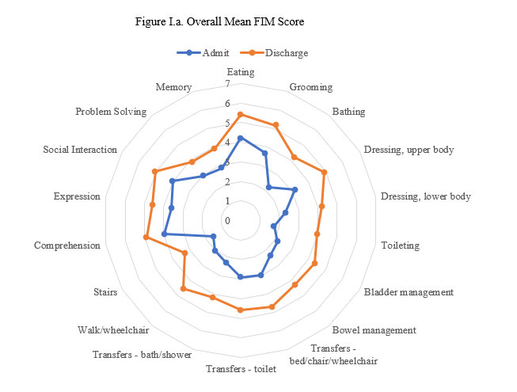
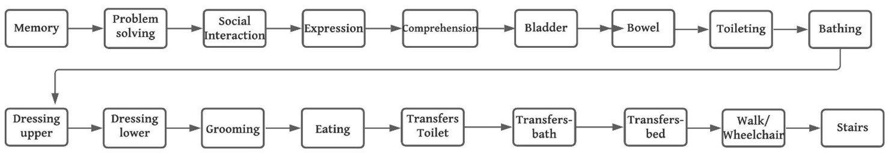
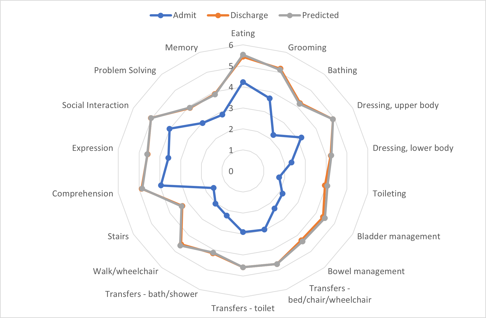
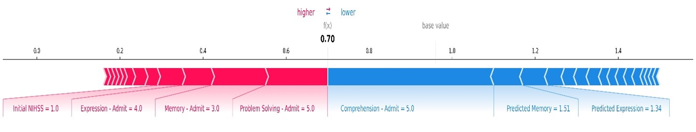
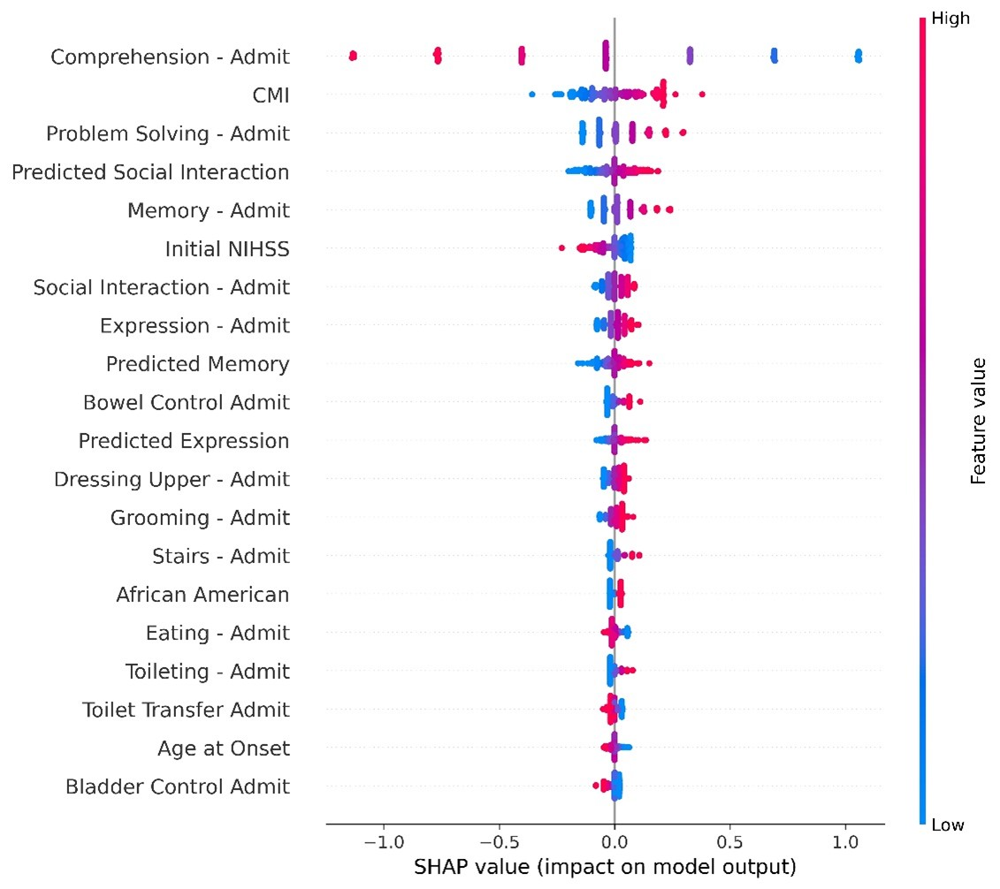

# Interpretable Machine Learning approach to predict discharge time eighteen-item Functional Independence Measure (FIM) scores for Stroke Rehabilitation

**Background and Purpose**
Stroke is the leading cause of disability in the United States. Rehabilitation is vital in stroke for recovery. Functional Independence Measure (FIM) is a validated survey instrument comprising of an eighteen-item, seven-level ordinal scale measured at the time of admission and discharge from the rehabilitation center. Predicting all individual 18 items at the time of admission to the rehabilitation center, although difficult, can help plan a better personalized rehabilitation program and answer the expectations of patients and their families. Explaining the individual item predictions at the patient level can help identify the primary outcome predictors and further individualize the rehabilitation plan. This is first of its kind study to predict all 18-item FIM score individually (multioutput) using machine learning.

**Methods**
The study population consisted of retrospectively collected data from 803 patients (52% male, 45% Caucasian, 18% African American, 79% ischemic stroke) admitted to Memorial Hermann Comprehensive Stroke Center, Houston, Texas, USA. FIM score comprises of 18 items containing ordinal values making it a multioutput regression problem. Popular machine learning and deep learning models like chained Bayesian Ridge Regression, XGBoost, Lightgbm, Random Forest, TabNet were developed. The models were tuned using ree-structured Parzen Estimator algorithm.  SHAP (Shapley Additive explanations) values were obtained to explain the predictions.

**Results**
Predictions for all 18 individual items in FIM were obtained. The best-performing model was a chained regression model using Bayesian ridge regression. The uniform mean absolute error for all 18 items was 0.80. Patient-level and population-level interpretability was obtained with the help of SHAP values.

**Conclusion**
Our findings strongly suggest that although predicting individual items in the FIM instrument is challenging, it can be done  using state-of-the-art machine learning models. The predictions, along with the explanations, can help develop a personalized rehabilitation plan.  

# Manuscript
[Complete manuscript](data/FIM_score_prediction_Khush_Patel.pdf)


# Code
Due to HIPAA rules for patient data and active research in progress, no data can be shared. Python packages used for the project included:
```
1. TabNet : Attentive Interpretable Tabular Learning
2. scikit-learn
3. PyTorch
4. Local Interpretable Model-Agnostic Explanations (lime)
5. SHAP (SHapley Additive exPlanations)
6. LightGBM
7. XGBoost
```
<hr />

# Result figures

**Initial FIM scores**



**Sequence used for chained regression model**



**Discharge actual vs predicted FIM score and admission FIM score**



**SHAP score**






<hr />

# How to cite
This repository is a research work in progress. Please contact author (drpatelkhush@gmail.com) for details on reuse of code.

